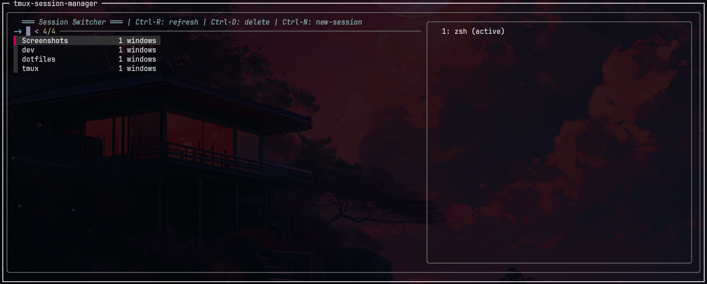
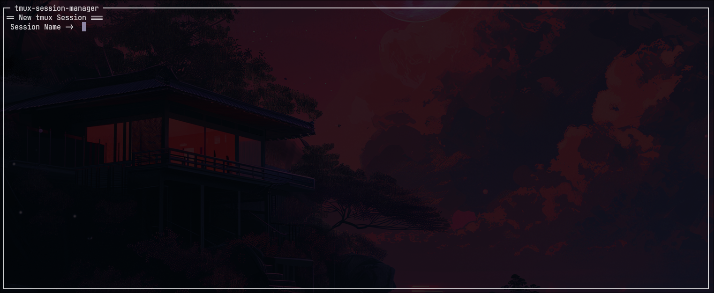

# tmux-fzf-manager

Inspired by the original project: [santoshxshrestha/tmux-session-manager](https://github.com/santoshxshrestha/tmux-session-manager)

A fuzzy terminal popup to manage tmux sessions/windows/panes using `fzf`.


 (Not implemented yet)

Just a simple and fast window manager for tmux — available as a plugin or standalone. It opens a popup using `fzf` where you can:

- View all sessions/windows/panes (or excluding your current one)
- Switch to it or kill it with a keybind
- Create new session/window/pane and switch to the newly create one

---

## Requirements

- `tmux` 3.2 or higher (for `display-popup`)
- [`fzf`](https://github.com/junegunn/fzf)
- Common UNIX tools (`awk`, `bash`)

---

## Installation

### Via TPM (Tmux Plugin Manager)

1. Add plugin to your `~/.tmux.conf`:

```bash
set -g @plugin 'riodelphino/tmux-fzf-manager'
```

2. Press `prefix` + `I` to install

### Manual Installation

1. Clone the repository:

```bash
git clone https://github.com/riodelphino/tmux-fzf-manager ~/.tmux/plugins/tmux-fzf-manager
```

2. Add to your `~/.tmux.conf`:

```bash
run-shell ~/.tmux/plugins/tmux-fzf-manager/tmux-fzf-manager.tmux
```

3. Reload tmux config:

```bash
tmux source-file ~/.tmux.conf
```

## Usage

### Default Key Binding

- **Press `prefix` + `s`** to open the session manager
- **Press `prefix` + `w`** to open the window manager
- **Press `prefix` + `P`** to open the pane manager

### Custom Key Binding

Add to your `~/.tmux.conf` to change the default key:

```bash
set -g @fzf_manager_key_session 's'
set -g @fzf_manager_key_window 'w'
set -g @fzf_manager_key_pane 'P'
```

### Include current one

To include current session/window/pane to the list:

```bash
set -g @fzf_manager_include_current 1  # 0:Exclude(Default) / 1:Include
```

### Popup

Popup config:

```bash
set -g @fzf_manager_width '80%'
set -g @fzf_manager_height '60%'
```

### Controls

Once opened:

- **Type to search** - Fuzzy find sessions/windows/panes by name
- **Enter** - Switch to selected session/window/pane
- **Ctrl-R** - Refresh the session/window/pane list
- **Ctrl-D** - Delete the selected one
- **Ctrl-A** - Create new session/window/pane and switch to newly created one
- **Esc** - Close without switching


## Troubleshooting

**Popup doesn't appear?**

- Make sure you have tmux 3.2+: `tmux -V`
- Check if `display-popup` is available: `tmux list-commands | grep popup`

**fzf not found?**

- Install fzf: `brew install fzf` or `apt install fzf`
- Or follow the [official fzf installation guide](https://github.com/junegunn/fzf#installation)

**No sessions/windows/panes to switch to?**

- As default, The manager only shows _other_ sessions/windows/panes (not your current one)
- Create more sessions/windows/panes: `tmux new-session` or `tmux new-window` or `tmux split-window`

**Key binding conflicts?**

If `prefix + w` conflicts with existing bindings, change it:

```bash
set -g @fzf_manager_key 'your-preferred-key'
```

## 🤝 Contributing

Found a bug or have a feature idea? Feel free to open an issue or submit a PR!

## TODO

- Replace the images to tmux-fzf-manager's ones.
- Enable `pane.sh`


## License

MIT License - [LICENSE](LICENSE) feel free to use this however you want!

This project is based on:
[santoshxshrestha/tmux-session-manager](https://github.com/santoshxshrestha/tmux-session-manager)

---

**⭐ Star this repo if it made your tmux workflow better!**
